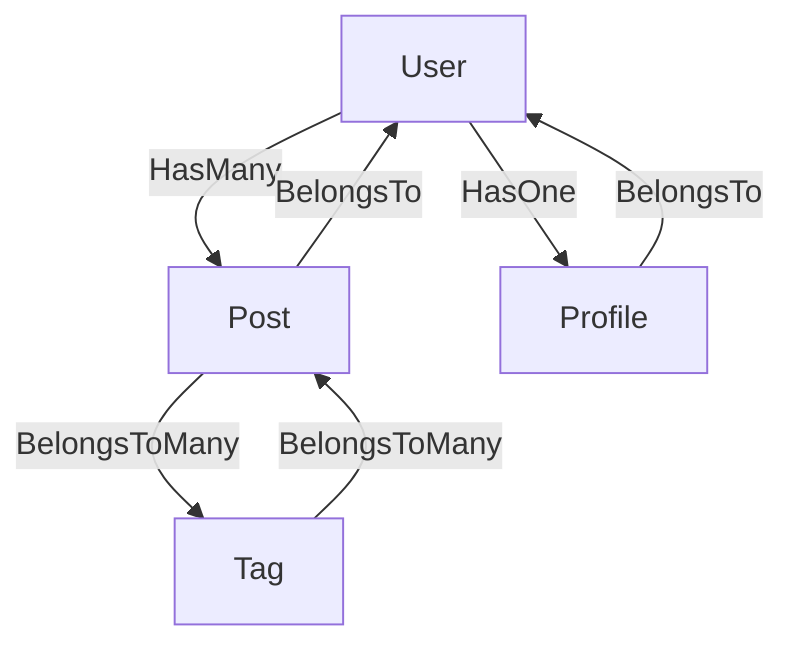

<p align="center">
    
    <p align="center">
        <a href="https://github.com/matakltm/laravel-model-graph/actions"></a>
        <a href="https://packagist.org/packages/matakltm/laravel-model-graph"></a>
        <a href="https://packagist.org/packages/matakltm/laravel-model-graph"></a>
        <a href="https://packagist.org/packages/matakltm/laravel-model-graph"></a>
        <a href="https://github.com/matakltm/laravel-model-graph"></a>
    </p>
</p>

------

# Laravel Model Graph

**Laravel Model Graph** is a powerful package that analyzes your Laravel Eloquent models and their relationships to generate a visual graph. It uses reflection and database schema inspection to build a comprehensive JSON representation, which is then visualized using a built-in React Flow SPA.

> **Requires [PHP 8.4+](https://php.net/releases/)**
> **Requires [Laravel 10.33+](https://laravel.com/)**

## Features

- 🔍 **Model Discovery**: Automatically scans your models directory.
- 🔗 **Relationship Detection**: Supports all Eloquent relationships (HasOne, HasMany, BelongsTo, BelongsToMany, MorphTo, etc.).
- 🏗 **Schema Inspection**: Extracts column details, types, and foreign keys directly from the database.
- 📊 **JSON Export**: Generates a structured JSON file compatible with React Flow.
- 🌐 **Built-in UI**: Includes a prebuilt React SPA to visualize your model graph at `/graph`.
- ⚡ **Performant**: Caches discovered models and supports file-based graph storage.

## Installation

Install the package via composer:

```bash
composer require matakltm/laravel-model-graph --dev
```

Publish the configuration file:

```bash
php artisan vendor:publish --tag=model-graph-config
```

Publish the frontend assets:

```bash
php artisan vendor:publish --tag=model-graph-assets
```

## Configuration

The configuration file is located at `config/model-graph.php`. Key options include:

- `enabled`: Enable or disable the package (default: `true`).
- `auto_generate`: Automatically generate graph data when requested via API (default: `true`).
- `environments`: Allowed environments (default: `['local', 'testing']`).
- `allow_production`: Allow running in production (default: `false`).
- `storage_path`: Where to store the generated JSON file.
- `scan.models_path`: The directory where your models are located.

## Usage

### Artisan Command

You can manually generate the graph JSON using the following command:

```bash
php artisan model-graph:generate
```

Options:
- `--force`: Overwrite the existing JSON file without confirmation.
- `--dry-run`: Simulate generation and output the JSON to the console.
- `--pretty`: Pretty-print the generated JSON.

### Visualizing the Graph

Once installed and assets are published, you can access the visual graph at:

`YOUR_APP_URL/graph`

The UI will automatically fetch the data from `/api/v1/graph/data`.

## JSON Output Format

The generated JSON follows a structured format designed for graph visualization:

```json
{
  "meta": {
    "generated_at": "2024-03-20T10:00:00+00:00",
    "environment": "local",
    "model_count": 2,
    "relationship_count": 1
  },
  "nodes": [
    {
      "id": "App\\Models\\User",
      "name": "User",
      "table": "users",
      "columns": [...],
      "relationships_count": 1
    }
  ],
  "edges": [
    {
      "id": "user_posts_post",
      "source": "App\\Models\\User",
      "target": "App\\Models\\Post",
      "type": "HasMany",
      "label": "posts",
      "metadata": { ... }
    }
  ]
}
```

## Relationship Reference

Here is a visual representation of how relationships are mapped:



## Development & Testing

🧹 Keep a modern codebase with **Pint**:
```bash
composer lint
```

✅ Run refactors using **Rector**
```bash
composer refactor
```

⚗️ Run static analysis using **PHPStan**:
```bash
composer test:types
```

🚀 Run the entire test suite:
```bash
composer test
```

## Credits

**Laravel Model Graph** was created by **[Micheal Ataklt](https://github.com/matakltm-code)** under the **[MIT license](https://opensource.org/licenses/MIT)**.
